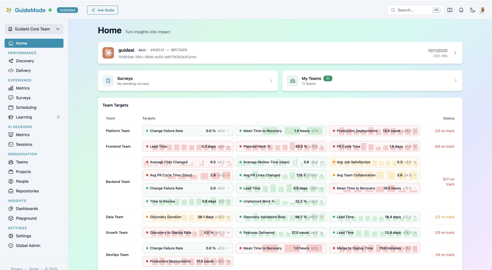
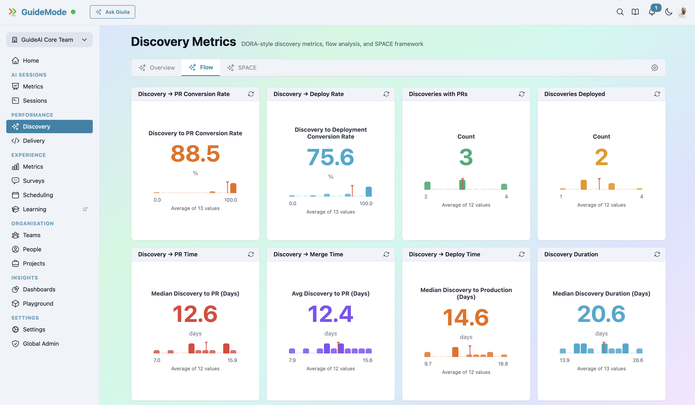
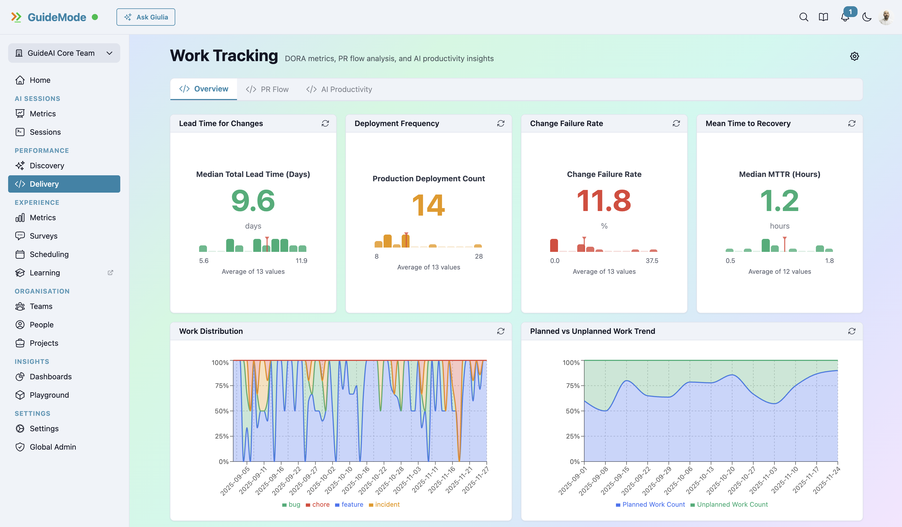
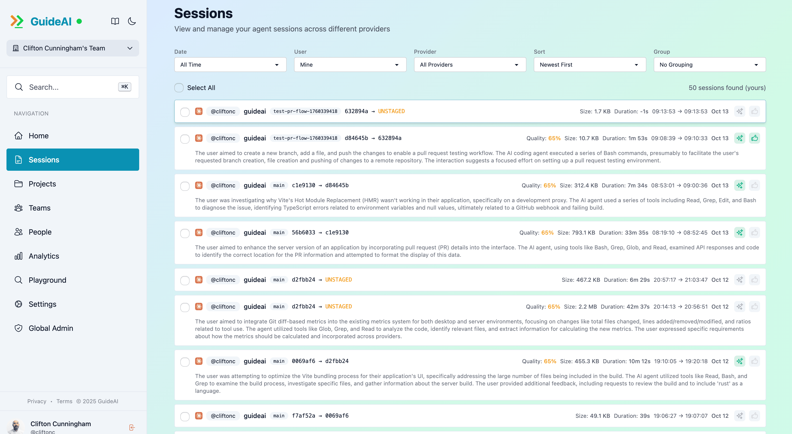
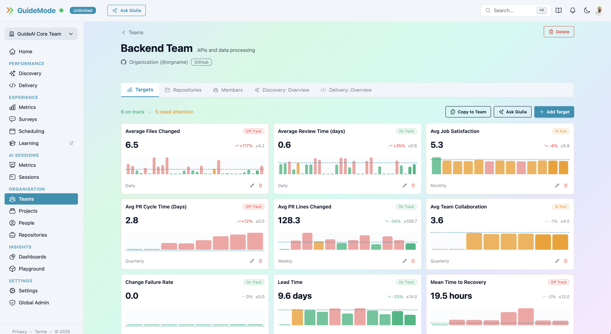
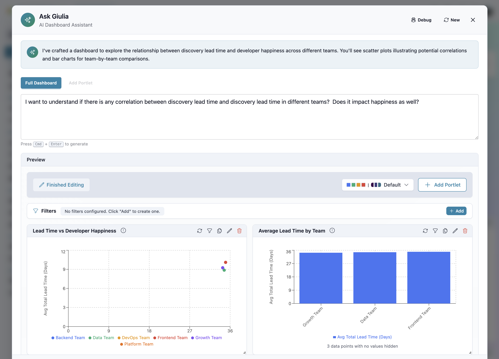

# GuideMode

<p align="center">
  
</p>

<h3 align="center"><strong>DX² — Measure Discovery and Delivery</strong></h3>

<p align="center">
The only platform measuring both Discovery and Delivery.<br />
Track your complete team journey from research validation to production deployment.
</p>

<p align="center">
  <strong>220+ Dimensions</strong> · <strong>300+ Measures</strong> · <strong>5 AI Providers</strong> · <strong>DORA Metrics</strong>
</p>

<p align="center">
  <a href="https://guidemode.dev">Website</a> ·
  <a href="https://app.guidemode.dev">App</a> ·
  <a href="https://docs.guidemode.dev">Docs</a>
</p>

---

<p align="center">
  
</p>

## What is GuideMode?

Most engineering analytics platforms only measure **delivery** — what you ship. But that's only half the story. What about the research, validation, and discovery that happens before code is written?

**GuideMode** is a **DX² (Discovery × Delivery)** platform that measures the complete product development lifecycle:

- **Discovery**: Research validation, customer feedback loops, experiment frequency, discovery cycle time
- **Delivery**: DORA metrics, pull request analytics, deployment frequency, cycle time
- **AI Intelligence**: Track AI coding sessions across 5 providers with 119 session-level metrics

Neither matters in isolation — fast delivery of the wrong thing is waste, and great discovery without delivery means ideas never ship. GuideMode gives you visibility into both.

---

## Key Features

### Discovery Analytics



Track your product discovery process:
- Research validation and experiment tracking
- Customer touchpoint frequency
- Discovery-to-feature conversion rates
- SPACE surveys for team sentiment

### Delivery Metrics



Complete DORA metrics and flow analytics:
- Deployment frequency, lead time, change failure rate, MTTR
- 48 pull request measures
- 53 issue tracking measures
- Industry benchmarking

### AI Session Intelligence



The only platform tracking individual AI coding sessions:
- **Claude Code** — Full plan mode, todo tracking, tool usage
- **Cursor** — Conversation tracking, code suggestions
- **GitHub Copilot** — Code completions, acceptance rates
- **Gemini Code Assist** — Tool usage, code generation
- **OpenCode** — Session monitoring, effectiveness metrics

119 session-level metrics including conversation patterns, git operations, and productivity indicators.

### Team Targets



Set and track team KPIs:
- Target any of 300+ measures
- Daily, weekly, monthly, or quarterly tracking
- AI-powered target recommendations
- Real-time progress indicators

### Giulia — AI Dashboard Assistant



Create analytics dashboards using natural language. Ask questions like *"Show me the correlation between lead time and developer happiness"* and Giulia generates a complete dashboard.

---

## Integrations

GuideMode connects your entire development stack:

| Integration | Capabilities |
|-------------|--------------|
| **GitHub** | Organizations, teams, repos, PRs, issues, deployments, DORA metrics |
| **Jira** | Teams, projects, issues, real-time webhooks |
| **Linear** | Workspaces, teams, projects, auto-configured webhooks |
| **Notion** | Flexible database mapping for work tracking |
| **CLI** | Create issues and deployments from terminal or CI/CD |

---

## Open Source

GuideMode's client-side components are MIT licensed and open source:

| Package | Description | Download | License |
|---------|-------------|----------|---------|
| [@guidemode/desktop](https://github.com/guidemode/desktop) | Cross-platform Tauri menubar app | [](https://www.guidemode.dev/ai-analytics/) | [](https://github.com/guidemode/desktop/blob/main/LICENSE) |
| [@guidemode/cli](https://github.com/guidemode/cli) | Command-line interface | [](https://www.npmjs.com/package/@guidemode/cli) | [](https://github.com/guidemode/cli/blob/main/LICENSE) |
| [@guidemode/types](https://github.com/guidemode/types) | Shared TypeScript types | [](https://www.npmjs.com/package/@guidemode/types) | [](https://github.com/guidemode/types/blob/main/LICENSE) |
| [@guidemode/session-processing](https://github.com/guidemode/session-processing) | Session parsing & analytics | [](https://www.npmjs.com/package/@guidemode/session-processing) | [](https://github.com/guidemode/session-processing/blob/main/LICENSE) |

### Contributing

We welcome contributions to our open source packages! Fork and submit PRs to the individual repositories above. See each repo's CONTRIBUTING.md for guidelines.

---

## Getting Started

**Three ways to use GuideMode:**

### 1. Web Platform
Visit [app.guidemode.dev](https://app.guidemode.dev) to get started with the full analytics platform.

### 2. Desktop App (Free)
Download the menubar app for automatic AI session tracking:

- [**macOS**](https://install.guidemode.dev/desktop/latest/GuideMode-Desktop-macOS.dmg) — Universal binary (Intel & Apple Silicon)
- [**Windows**](https://install.guidemode.dev/desktop/latest/GuideMode-Desktop-windows.msi) — Windows 10+
- [**Linux**](https://install.guidemode.dev/desktop/latest/GuideMode-Desktop-linux.deb) — .deb package

### 3. CLI
```bash
npm install -g @guidemode/cli
```

---

## Tech Stack

- **Frontend**: TypeScript, React, Tailwind CSS
- **Backend**: TypeScript, Hono, Cloudflare Workers
- **Desktop**: Rust, Tauri, React
- **Database**: PostgreSQL (Neon)
- **Analytics**: 19 cubes, 220+ dimensions, 300+ measures

---

## Resources

| | |
|---|---|
| Website | [guidemode.dev](https://guidemode.dev) |
| App | [app.guidemode.dev](https://app.guidemode.dev) |
| Documentation | [docs.guidemode.dev](https://docs.guidemode.dev) |
| Support | support@guidemode.dev |
| Security | security@guidemode.dev |

---

## License

- **Open Source Components**: MIT License
- **Server Application**: Proprietary (contact us for enterprise licensing)

---

<p align="center">
  <strong>GuideMode</strong> — Measure what matters, from discovery to delivery.
</p>
